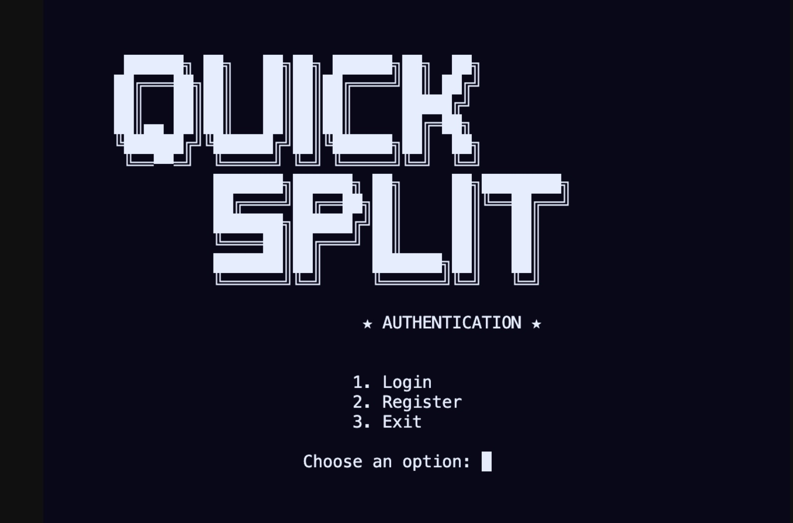
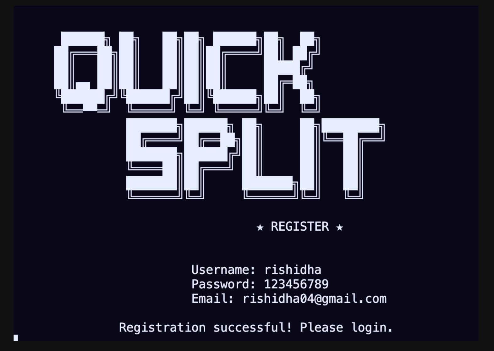
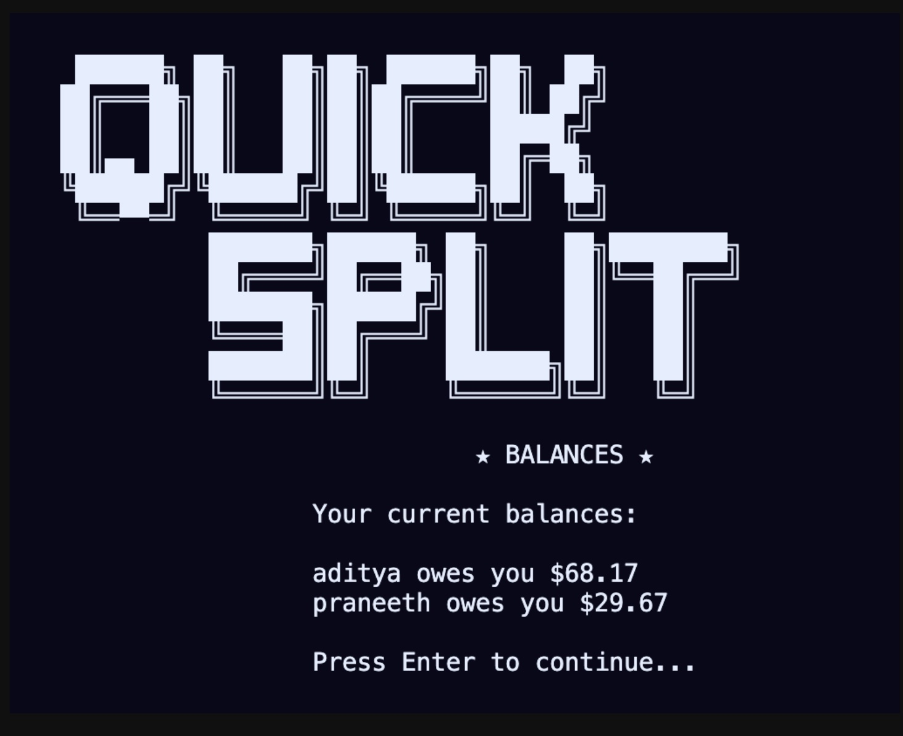
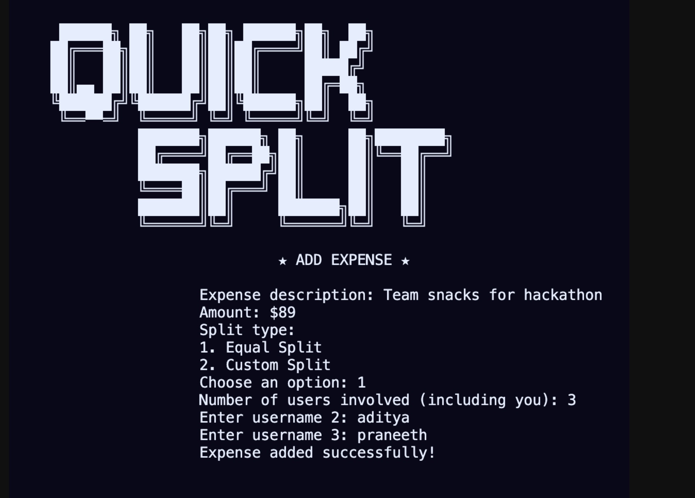
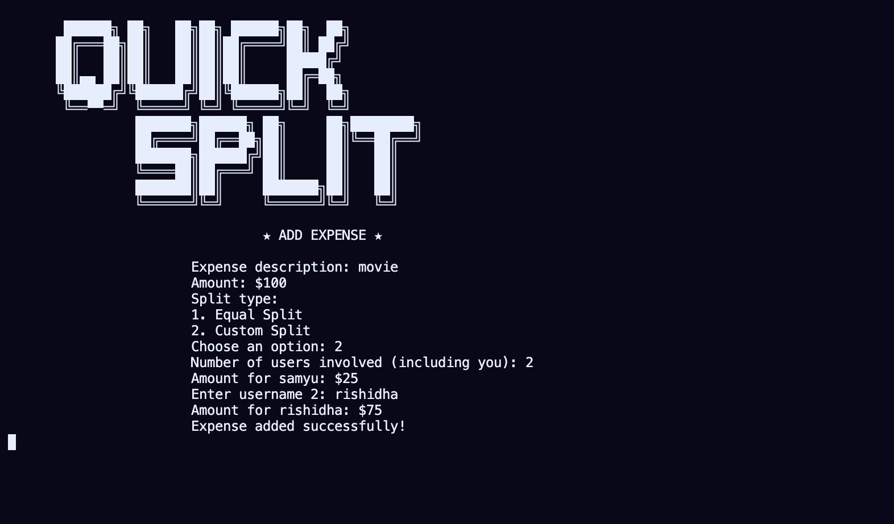
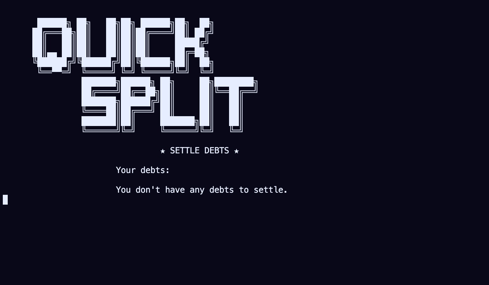
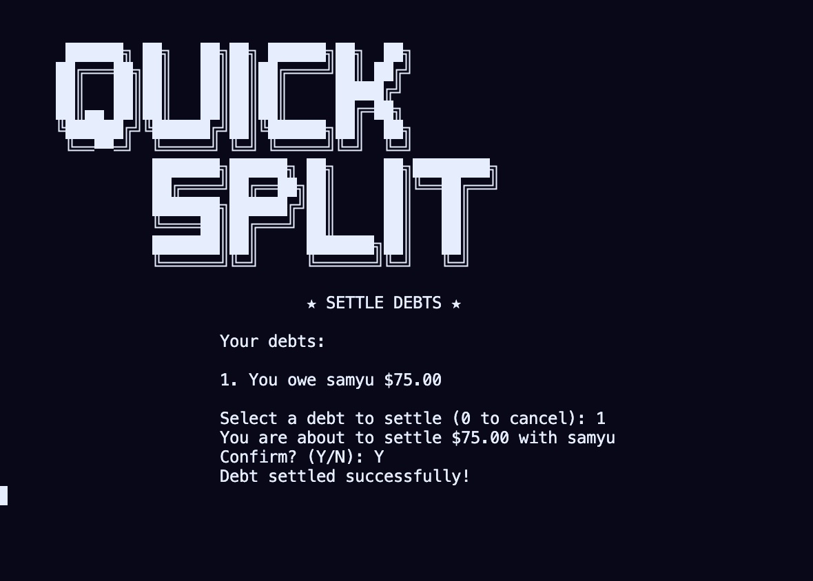
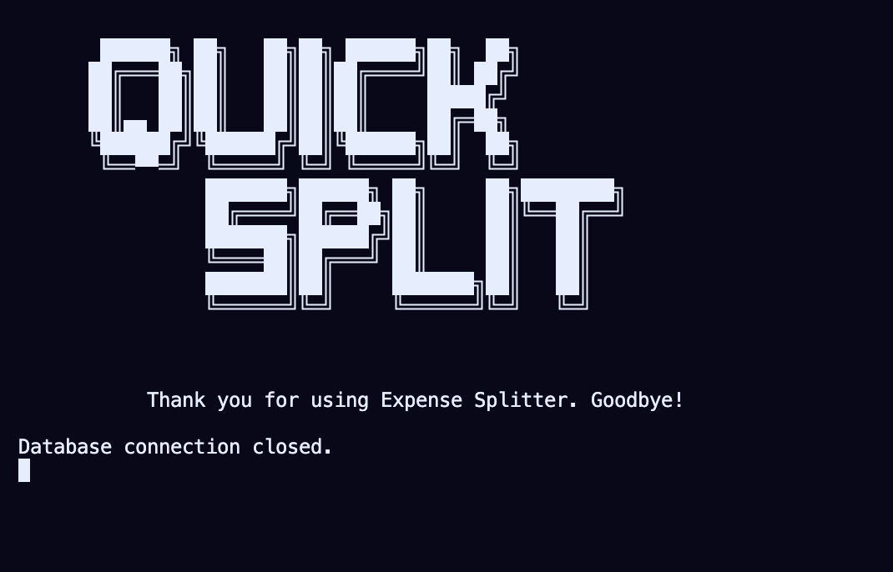

# Quick Split

A Java-based console application for splitting expenses among friends and keeping track of who owes what. Think of it as a simplified version of Splitwise.

## Features

- **User Management**: Register and login to personal accounts
- **Expense Tracking**: Add expenses with descriptions and amounts
- **Flexible Splitting**: Choose between equal splits or custom splits
- **Balance Management**: View who owes you and whom you owe
- **Debt Settlement**: Settle up debts with other users
- **Expense History**: View your past expenses and splits

## Working images

| Login Screen | Adding an Expense | Viewing Balances |
|:------------:|:-----------------:|:----------------:|
|  |  |  |
| Equal split | Custom Split | Viewing Balances |
|  |  |  |
| No debts | Settle debts | Exit |
|  |  |  |

## Prerequisites

To run this application, you need:

### For Windows
- Java Development Kit (JDK) 11 or higher
  - Download from [Oracle](https://www.oracle.com/java/technologies/javase-downloads.html) or [OpenJDK](https://adoptopenjdk.net/)
  - Verify installation with `java -version` in Command Prompt
- Maven (optional, for building from source)
  - Download from [Apache Maven](https://maven.apache.org/download.cgi)
  - Add to your PATH as described in the [Maven installation guide](https://maven.apache.org/install.html)
  - Verify installation with `mvn -version`

### For macOS/Linux
- Java Development Kit (JDK) 11 or higher
  - Install using Homebrew (macOS): `brew install openjdk@11`
  - Install on Ubuntu/Debian: `sudo apt install openjdk-11-jdk`
  - Verify installation with `java -version` in Terminal
- Maven (optional, for building from source)
  - Install using Homebrew (macOS): `brew install maven`
  - Install on Ubuntu/Debian: `sudo apt install maven`
  - Verify installation with `mvn -version`

## Quick Start


### Build from Source

1. Clone the repository:
   ```
   git clone https://github.com/Adityabandaru18/Quick-Split.git
   cd expense-splitter
   ```

2. Build with Maven:
   ```
   mvn clean package
   ```

3. Run the application:
   ```
   java -jar target/expense-splitter-1.0-SNAPSHOT-jar-with-dependencies.jar
   ```

### Using the Application

1. **First Run**:
   - Register a new account when you first start the application
   - Remember your username and password for future logins

2. **Adding Users**:
   - Before splitting expenses, make sure all the users are registered in the system
   - Each user needs to create their own account

3. **Adding an Expense**:
   - Select option 1 from the main menu
   - Enter the expense description and amount
   - Choose between equal or custom split
   - For custom splits, enter the amount each person should pay

4. **Viewing Balances**:
   - Select option 2 from the main menu
   - See a summary of who owes you money and who you owe

5. **Settling Debts**:
   - Select option 3 from the main menu
   - Choose a debt to settle
   - Confirm the settlement

6. **Viewing Expense History**:
   - Select option 4 from the main menu
   - See a list of all expenses you've created

## Database Setup

ExpenseSplitter uses SQLite, which means:
- No separate database installation required
- The database file is created automatically in the `data` directory
- All your data is stored locally on your machine

## Technical Details

- **Programming Language**: Java 11
- **Database**: SQLite 3
- **Build Tool**: Maven
- **Dependencies**: SQLite JDBC Driver

## Project Structure

```
ExpenseSplitter/
├── src/
│   ├── main/
│   │   ├── java/
│   │   │   └── com/
│   │   │       └── expensesplitter/
│   │   │           ├── Main.java
│   │   │           ├── db/
│   │   │           ├── model/
│   │   │           ├── service/
│   │   │           └── ui/
│   │   └── resources/
│   │       └── schema.sql
├── data/
│   └── expensesplitter.db
├── pom.xml
└── README.md
```
## Note:
For a good experience, make your terminal full screen.🫣
